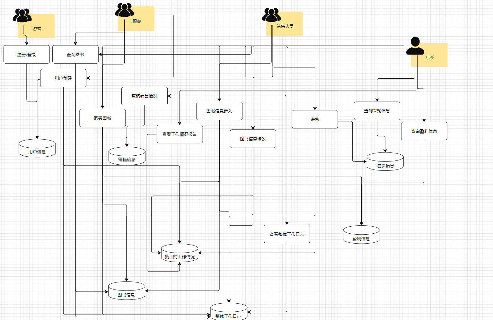
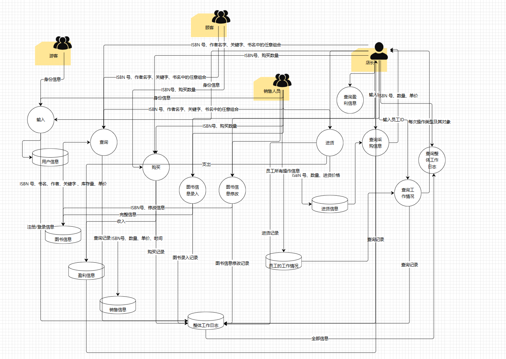

# BookStore需求分析文档
## 业务流图

## 数据流图

## 数据词典
### 基本数据
| 数据含义          | 数据组成                    |
|---------------|-------------------------|
| 个人ID          | 长度不超过16个字符的字符串          |
| 密码            | 长度不超过16个字符的字符串          |
| ISBN号         | 20 个字符，每本正版书都有惟一的标识     |
| 书名            | 60 个字符                  |
| 作者            | 60 个字符                  |
| 关键字           | 字符串，长度不超过60             |
| 库存量/销售数量/进货数量 | 整型                      |
| 单价/收入/支出/利润   | 非负实型                    |
| 操作种类          | 1个字符                    |
| 时间            | 年、月、日、时、分、秒，6个整型数组成的结构体 |
### 数据流
| 数据含义                   | 数据组成                                                 |
|------------------------|------------------------------------------------------|
| 身份信息（注册/登录时输入）         | 个人ID、密码                                              |
| 图书部分信息（查询时输入）          | ISBN号、作者名字、关键字、书名中的任意组合                              |
| 图书信息（查询时输出）            | ISBN号、作者名字、关键字、书名、库存量、单价                             |
| 时间区间（查询时输入）            | 开始时间、结束时间                                            |
| 销售信息（查询时输出）            | ISBN号、销售数量、单价                                        |
| 盈利信息（查询时输出）            | 收入、支出、利润                                             |
| 进货信息（采购时输入）            | ISBN号、数量、进货价格                                        |
| 进货信息（查询时输出）            | 采购时间、ISBN号、数量、进货价格                                   |
| 销售时间、查询对象（查询员工工作情况时输入） | 时间、查询对象的个人ID                                         |
| 员工工作情况（查询时输出）          | 时间、操作种类、操作对象信息                                       |
| 系统整体工作日志（查询时输出）        | 时间、身份ID、操作种类、操作对象（根据操作种类可能是身份信息、图书信息、销售信息、盈利信息、进货信息） |
### 文件流
| 数据含义     | 数据组成                                                 |
|----------|------------------------------------------------------|
| 身份信息     | 个人ID、密码                                              |
| 图书信息     | ISBN号、作者名字、关键字、书名、库存量、单价                             |
| 销售信息     | 销售时间、ISBN号、销售数量、单价                                   |
| 盈利信息     | 收入、支出、利润                                             |
| 进货信息     | 采购时间、ISBN号、数量、进货价格                                   |
| 员工工作情况   | 员工身份ID、时间、操作种类、操作对象信息                                |
| 系统整体工作日志 | 时间、身份ID、操作种类、操作对象（根据操作种类可能是身份信息、图书信息、销售信息、盈利信息、进货信息） |
## 功能说明
| 模块名称       | 功能描述                                                     | 输入参数            | 输出参数                                             |
|------------|----------------------------------------------------------|-----------------|--------------------------------------------------|
| 注册         | 保存个人ID与密码，并把操作数据存入“身份信息”                                 | 个人ID、密码         | ID合法且唯一 -> 反馈操作成功信息 // ID重复 -> 反馈错误信息            |
| 登录         | 登入系统                                                     | 个人ID、密码         | 个人ID存在于“身份信息”中,且密码匹配 -> 输出登录成功信息 // 否则 -> 登录失败信息 |
| 创建用户       | 分配个人ID，并把操作数据存入“身份信息”、“员工工作情况”、“系统整体工作日志”                | 个人信息、操作员工ID     | 反馈操作信息                                           |
| 查询图书       | 用图书部分信息查询完整信息                                            | 图书部分信息          | 图书信息                                             |
| 图书信息录入     | 初次录入图书信息，并把数据存入“图书信息”、“员工工作情况”、“系统整体工作日志”                | 图书信息、操作员工ID     | 反馈操作信息                                           |
| 图书信息修改     | 修改图书信息，并把数据存入“图书信息”、“员工工作情况”、“系统整体工作日志”                  | 图书（部分）信息、操作员工ID | 反馈操作信息                                           |
| 进货         | 修改图书信息、盈利信息、进货信息，并把数据存入“进货信息”、“图书信息”、“员工工作情况”、“系统整体工作日志” | 图书部分信息、操作员工ID   | 反馈操作信息                                           |
| 购买图书       | 购买图书，并把数据更改存入“销售信息”、“图书信息”、“盈利信息”、“系统整体工作日志”             | ISBN号、购买数量      | 反馈操作信息                                           |
| 查询销售情况     | 查询特定时间段的销售情况                                             | 开始时间、结束时间       | 售出图书的ISBN号、数量、单价                                 |
| 查看工作情况报告   | 查询某员工的工作情况报告                                             | 员工个人ID          | 操作种类、操作对象                                        |
| 查询采购信息     | 查询特定时间段的采购信息                                             | 开始时间、结束时间       | 采购图书的ISBN号、数量、单价                                 |
| 查询盈利信息     | 查询特定时间段的盈利情况                                             | 开始时间、结束时间       | 收入、支出、利润                                         |
| 查看系统整体工作日志 | 查询整个系统的操作信息                                              | （无）             | 操作时间、操作者、操作种类、操作对象                               |
## 用户交互设计
| 操作名称       | 输入格式                                                                                                                                | 输出格式                                                                                                 |
|------------|-------------------------------------------------------------------------------------------------------------------------------------|------------------------------------------------------------------------------------------------------|
| 注册         | 一个字符串“ID: <ID> PASSWORD: <密码>”                                                                                                      | 一个字符串 “SUCCESSFULLY SIGNED UP” 或 “SIGN UP FAILED: REPEATED ID”                                       |
| 创建用户       | 一个字符串“ID: <ID> PASSWORD: <密码> OPERATOR: <操作者ID>”，操作者ID填“-”默认为店长                                                                     | 一个字符串 “SUCCESSFULLY CREATED” 或 “CREAT FAILED: REPEATED ID”                                           |
| 登录         | 一个字符串“ID: <ID> PASSWORD: <密码>”                                                                                                      | 一个字符串 “SUCCESSFULLY LOGGED IN” 或 “LOG IN FAILED: ID NOT EXIST” 或 “LOG IN FAILED: INCORRECT PASSWORD” |
| 查询图书       | 一个字符串“NUM: <ISBN号> WRITER: <作者名字> KEY: <关键字> TITLE: <书名>”，不输入在“<>”中填“-”                                                             | 一个字符串“NUM: <ISBN号> WRITER: <作者名字> KEY: <关键字> TITLE: <书名> STORAGE: <库存量> PRICE: <单价>”                 |
| 图书信息录入     | 一个字符串“NUM: <ISBN号> WRITER: <作者名字> KEY: <关键字> TITLE: <书名> STORAGE: <库存量> PRICE: <单价> OPERATOR: <操作者ID>”，操作者ID填“-”默认为店长               | 一个字符串 “SUCCESSFULLY SET UP” 或 “SET UP FAILED”                                                        |
| 图书信息修改     | 一个字符串“NUM: <ISBN号> WRITER: <作者名字> KEY: <关键字> TITLE: <书名> STORAGE: <库存量> PRICE: <单价> OPERATOR: <操作者ID>”，不输入在“<>”中填“-”，操作者ID填“-”默认为店长 | 一个字符串 “SUCCESSFULLY UPDATED” 或 “UPDATE FAILED”                                                       |
| 进货         | 一个字符串“NUM: <ISBN号> AMOUNT: <数量> PRICE: <进货价格> OPERATOR: <操作者ID>”，操作者ID填“-”默认为店长                                                     | 一个字符串 “SUCCESSFULLY IMPORTED” 或 “IMPORT FAILED”                                                      |
| 购买图书       | 一个字符串“NUM: <ISBN号> AMOUNT: <购买数量>”                                                                                                  | 一个字符串 “SUCCESSFULLY BROUGHT” 或 “BUY FAILED”                                                          |
| 查询销售情况     | 一个字符串“BEGIN: <开始时间> END: <结束时间>”                                                                                                    | 多行数据，每行都是一个字符串，格式为“<售出图书的ISBN号> <售出数量> <售出单价>”                                                       |
| 查看工作情况报告   | 一个字符串“<员工个人ID>”                                                                                                                     | 多行数据，每行都是一个字符串，格式为“<操作种类> <对应信息>”                                                                    |
| 查询采购信息     | 一个字符串“BEGIN: <开始时间> END: <结束时间>”                                                                                                    | 多行数据，每行都是一个字符串，格式为“<采购图书ISBN号> <采购数量> <购入单价>”                                                        |
| 查询盈利信息     | 一个字符串“BEGIN: <开始时间> END: <结束时间>”                                                                                                    | 一个字符串“IN: <总收入> OUT: <总支出> PROFIT: <总收入 - 总支出>”                                                      |
| 查看系统整体工作日志 | -                                                                                                                                   | 多行数据，每行都是一个字符串，格式为“TIME: <操作时间> OPERATOR: <操作者> KIND: <操作种类> OBJECT: <操作对象（数据）>”                     |